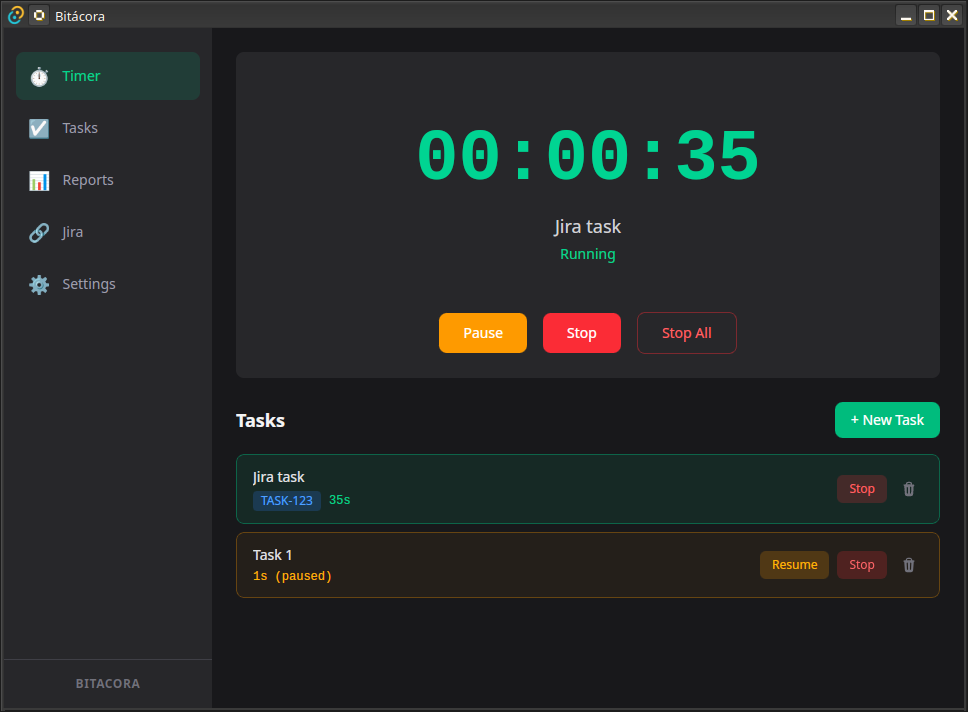
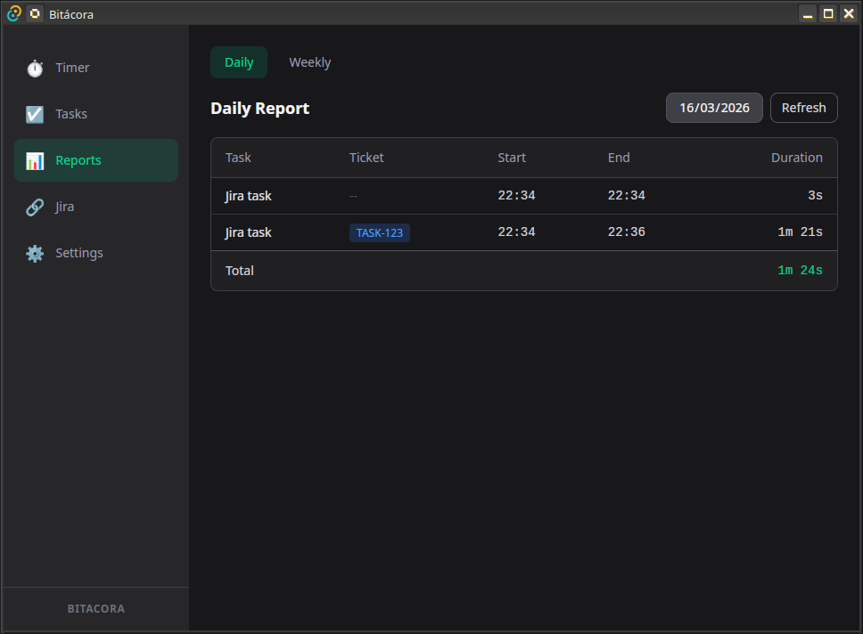

# Bitácora

Desktop time tracking app with Jira Cloud integration.

Track time on tasks, pause and switch between them freely, and sync worklogs to Jira when you're ready.



## Features

- **Multi-task timer** — pause one task, start another, come back later. Time is preserved
- **Jira integration** — link tasks to tickets, sync worklogs with one click
- **System tray** — always accessible, keeps running when you close the window
- **Global shortcuts** — `Ctrl+Shift+Space` pause/resume, `Ctrl+Shift+N` new task
- **Daily & weekly reports** — see where your time went


- **Local-first** — SQLite database, your data stays on your machine

## Stack

| Layer | Tech |
|-------|------|
| Framework | Tauri 2 |
| Frontend | React 19 + TypeScript + Tailwind CSS 4 |
| Backend | Rust |
| Database | SQLite (rusqlite) |
| HTTP | reqwest (Jira REST API v3) |

## Quick start

### Prerequisites

- **Rust** — `curl --proto '=https' --tlsv1.2 -sSf https://sh.rustup.rs | sh`
- **Node.js 22+** — via [nvm](https://github.com/nvm-sh/nvm) or your package manager
- **pnpm** — `npm install -g pnpm`
- **System libs** (Linux) — see [SYSTEM_DEPS.md](SYSTEM_DEPS.md) for the full list

```bash
# Install dependencies
pnpm install

# Run in development
pnpm tauri dev

# Build for production
pnpm tauri build
```

Bundles are generated in `src-tauri/target/release/bundle/` (.deb, .rpm, .AppImage on Linux).

## Project structure

```
src/                        # React frontend
  components/
    Timer/                  # Clock display + controls
    Tasks/                  # Task list, form, items
    Reports/                # Daily & weekly views
    Jira/                   # Sync panel
    Settings/               # Jira credentials + danger zone
    Layout/                 # Sidebar navigation
  hooks/                    # useTimer, useTasks, useReports, useJiraSync
  lib/                      # Tauri IPC wrapper, format utils
  types/                    # Shared TypeScript types

src-tauri/                  # Rust backend
  src/
    commands/               # IPC handlers (timer, tasks, reports, jira, settings)
    db/                     # SQLite init + migrations
    jira/                   # HTTP client + API models
    timer/                  # In-memory timer state machine
  capabilities/             # Tauri permission config
```

## How the timer works

The timer state lives in Rust memory for precision. The frontend polls every second.

- **Start** a task → if another is running, it gets **paused** (not stopped)
- **Pause** → time is preserved, resume anytime
- **Stop** → entry is persisted to SQLite with start time and duration
- **Stop All** → stops and persists every tracked timer at once

Multiple tasks can be paused simultaneously. Only one runs at a time.

## Jira sync

1. Go to **Settings** and enter your Jira Cloud URL, email, and [API token](https://id.atlassian.com/manage-profile/security/api-tokens)
2. Create tasks with a Jira ticket code (e.g. `ECO-123`)
3. Track time as usual
4. Go to **Jira** tab → review pending entries → adjust duration if needed → sync

Worklogs are posted via `POST /rest/api/3/issue/{key}/worklog` with Basic auth.

## License

[MIT](LICENSE)
